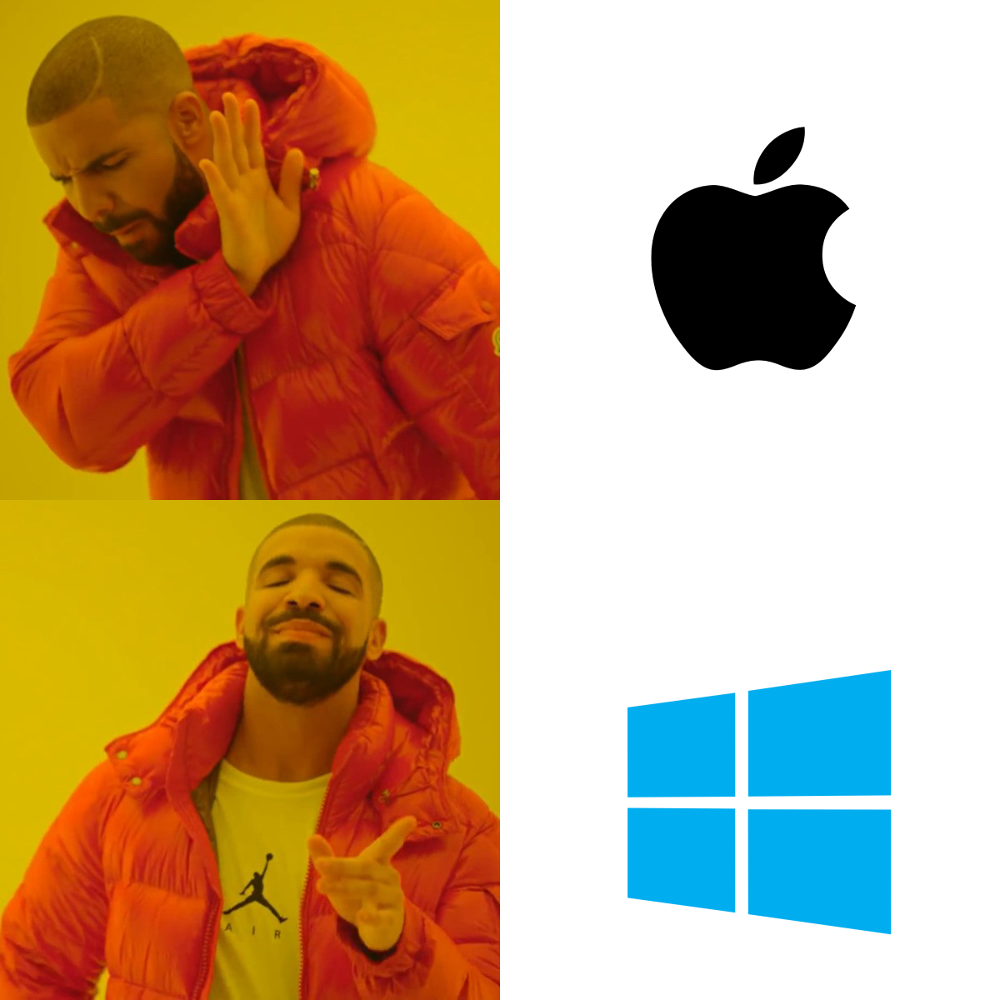

***Hello***            👋  
***Hola***             👋  
***Bonjour***          👋  
***Hallo***            👋  
***Ciao***             👋  
***こんにちは***        👋  
***مرحبا         👋***  
***Здравствуйте***     👋  
***नमस्ते***             👋  
***你好***              👋  

My name is Alex, and I like makin stuffs.

# Skills

  
  

# Preferences

  

